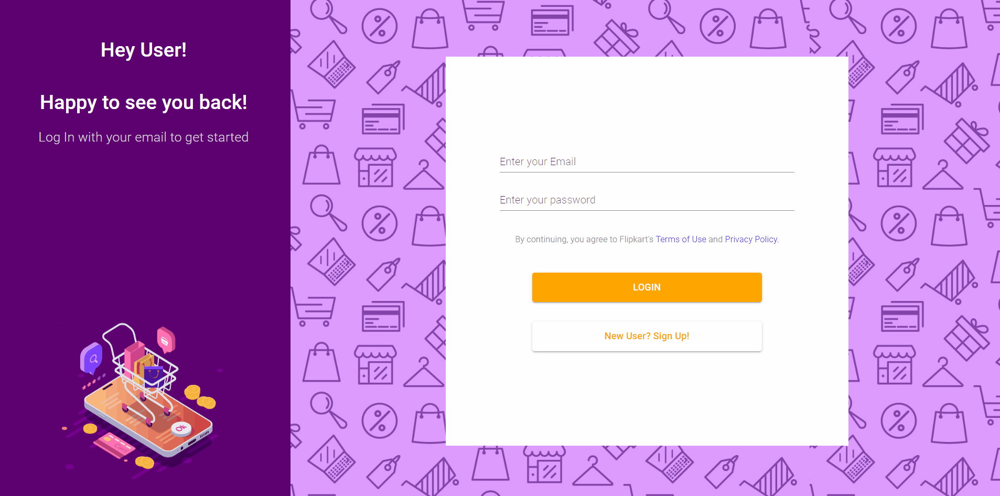

# Flipkart Clone
Clone of https://www.flipkart.com/

# Built With

- **M**ongoDB
- **E**xpress
- **R**eact
- **N**ode

# Installation

- Clone the repo and goto the dir
```sh
$ git clone https://github.com/r3yc0n1c/flipkart-clone.git
$ cd flipkart-clone
```
- Install dependencies
```sh
$ cd frontend
$ npm i .
$ cd ../backend
$ npm i .
```
- Start the server
```sh
$ cd backend
$ npm start
```
- Start the client
```sh
$ cd frontend
$ npm start
```

# Demo



# Contributing Guidelines

- Fork the Project
- Clone it
- Create your own branch ( git checkout -b feat/myFeature )
- Add your Changes ( git add . )
- Commit your Changes ( git commit -m 'added some features' )
- Push to the Branch ( git push origin feat/myFeature )
- Open a Pull Request describing the changes

# Contributors

- Sinjini Ghosh - [LinkedIn](https://www.linkedin.com/in/sinjini-ghosh/)  |  [GitHub](https://github.com/SINJINI-G) 


# Contacts

Twitter - https://twitter.com/r3yc0n1c

LinkedIn - https://www.linkedin.com/in/raja-majumdar/
